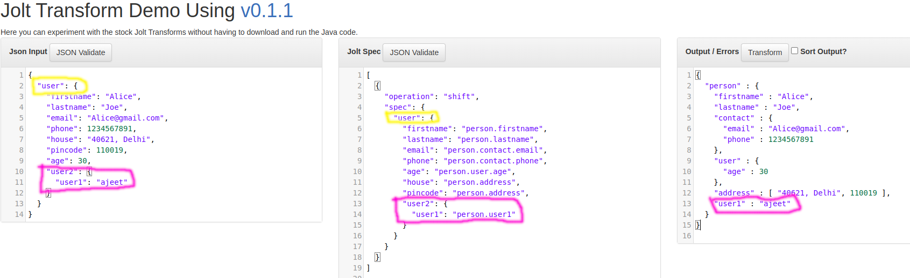

# Jolt
#### Request - 1 : http://localhost:9091/api/jolt/simplejsontojson1
```
{
  "firstname": "Alice",
  "lastname": "Joe",
  "email": "Alice@gmail.com",
  "phone": 1234567891,
  "house": "40621, Delhi",
  "pincode": 110019,
  "age": 30
}
```
In Jolt transformation, we assume a **Left Hand Side (LHS)** and a **Right Hand Side (RHS)**. **In the LHS, the key must be the same as the key in the Jolt schema**. This means that the keys in your input JSON should match the keys specified in your Jolt transformation schema for the transformation to be applied correctly.

#### Jolt Schema for Request - 1
```
[
  {
    "operation": "shift",
    "spec": {
      "firstname": "person.firstname", //It means that the value of the "firstname" key is extracted and placed inside the "firstname" field within the "person" object in the output JSON.
      "lastname": "person.lastname",
      "email": "person.contact.email", //It means that the value of the **"email"** key is extracted and placed inside the **"email"** field within the **"contact"** object within the **"person"** object in the output JSON
      "phone": "person.contact.phone",
      "age": "person.user.age",
      "house": "person.address", // It means that the value of the "address and pincode" key is extracted and placed in an array inside the "address" field within the "person" object in the output JSON.
      "pincode": "person.address" //
    }
  }
]

```
Here, we've created a Jolt schema using the shift operation and **extract values from the request's identical keys**, then placing these values inside a **"person"** object. You can see the result below:
* **Let's Understand below how it is work.**
  * **"firstname":person.firstname"** :- It means that the value of the **"firstname"** key is extracted and placed inside the **"firstname"** field within the **"person"** object in the output JSON. Result is - **{"person" : {"firstname" : "Alice"}}.**
  * **"email":person.contact.email"** :- It means that the value of the **"email"** key is extracted and placed inside the **"email"** field within the **"contact"** object within the **"person"** object in the output JSON. Result is - **{"person" : "contact" : {"email" : "Alice@gmail.com"}}**
  * **"house": "person.address","pincode": "person.address"** :- It means that the value of the **"address** and **pincode"** key is extracted and placed in **an array** inside the **"address"** field within the **"person"** object in the output JSON. Because we've placed both the values of **"address"** and **"pincode"** keys inside the **"address"** field within the "person" object. Result is - **{"person" : "address" : [ "40621, Delhi", 110019 ]}**

#### Result of Request -1 
```
{
  "person" : {
    "firstname" : "Alice",
    "lastname" : "Joe",
    "contact" : {
      "email" : "Alice@gmail.com",
      "phone" : 1234567891
    },
    "user" : {
      "age" : 30
    },
    "address" : [ "40621, Delhi", 110019 ]
  }
}
```


#### Request - 2 : http://localhost:9091/api/jolt/simplejsontojson1


```
{
  "user": {
    "firstname": "Alice",
    "lastname": "Joe",
    "email": "Alice@gmail.com",
    "phone": 1234567891,
    "house": "40621, Delhi",
    "pincode": 110019,
    "age": 30,
    "user2": {
      "user1": "ajeet"
    }
  }
}
```
Here, we have modified the request by encapsulating it within a **"user"** object and introducing new fields such as **"user2": { "user1": "ajeet" }.**


#### Jolt Schema for Request - 2
```
[
  {
    "operation": "shift",
    "spec": {
      "user": {
        "firstname": "person.firstname",
        "lastname": "person.lastname",
        "email": "person.contact.email",
        "phone": "person.contact.phone",
        "age": "person.user.age",
        "house": "person.address",
        "pincode": "person.address",
        "user2": {
          "user1": "person.user1"
        }
      }
    }
  }
]
```
When extracting data from the request, we first extract the **"user"** object, highlighted in yellow, and then retrieve data from the new field, highlighted in pink, You can see the highlighted colors in the image above, like **"user2": { "user1": "person.user1" }**. Result is - **"user1" : "ajeet"**

#### Result of Request -2
```
{
  "person" : {
    "firstname" : "Alice",
    "lastname" : "Joe",
    "contact" : {
      "email" : "Alice@gmail.com",
      "phone" : 1234567891
    },
    "user" : {
      "age" : 30
    },
    "address" : [ "40621, Delhi", 110019 ],
    "user1" : "ajeet"
  }
}
```


## One to Many and put value in an array
You can pick the value from particulate node and put into the multiple node.
#### Request - 3 : http://localhost:9091/api/jolt/simplejsontojson1
```
{
  "rating": {
    "primary": {
      "value": 3,
      "max": 5
    }
  }
}
```
#### Jolt Schema for Request - 3
```
[
  {
    "operation": "shift",
    "spec": {
      "rating": {
        "primary": {
          "value": ["person.v1", "person.v2"], //Here, we assign the same value to multiple nodes using an array.
          "max": "person.v3[]", //Here, we assign a value to a node in an array.
          "min": "person.v4[2]" //Suppose we want to assign a value to a particular index in an array. We specify the index value within square brackets
        }
      }
    }
  }
]
```
  * **"value": ["person.v1", "person.v2"] :** Here, we assign the same value to multiple nodes using an array.
  * **"max": "person.v3[]" :**  Here, we assign a value to a node in an array. The result is-**"v3" : [ 5 ]**
  * **"min": "person.v4[2]":**  Suppose we want to assign a value to a particular index in an array. We specify the index value within square brackets. The result is -  **"v4" : [ null, null, 1 ]**

#### Result of Request -3
```
{
  "person" : {
    "v1" : 3,
    "v2" : 3,
    "v3" : [ 5 ],
    "v4" : [ null, null, 1 ]
  }
}
```

## Request in an array
#### Request - 4 : http://localhost:9091/api/jolt/arrayjsontojson
```
[
{"exists or not":"true","application number":"APPL10754044","neo cif id":"GLBCUST0001000054643","creation_time_stamp":"11-MAY-17 01.51.00.390000000 PM","last_updated_time_stamp":"10-SEP-23 12.41.22.817000000 PM","customer number":"CUST100004567","product":"Business Loan Unsecured","product type":"Personal Finance","channel":"DSA\/Dealer","loan purpose":"Business Working Capital","scheme code":"BL_LOWTI","rate":23.05,"loan amount":665000,"tenure":36,"payment frequency":"Monthly","emi":"INR~25759","currency":"INR","loan stage name":"Post Disbursal","current processing stage":"CREDIT_APPROVAL","under writer result":"Approve","fi result":"Residence Verification - Neutral","applicant type":1,"deviation raised":"NegCIBIL, OwnrPrf1","first name":"RAFIQUDEEN","last name":"RS","date of birth":"1962-09-12","occupation type":"Salaried","phone number":"0141-04112047","mobile no":"98456645456","email id":"SALHGU345S@GMAIL.COM,SALASUHFFHUJ@GMAIL.COM","address":"E-145 NIRMA AJMER ROAD JAIPUR   Rajasthan Jaipur India","pan_number":"AMF66001N","loan branch code":"365","company name":"SALJYBH LAMINATION","dsa code":"8046879","contract no":"TCFBL03650000134323329","contract date":"30-JUN-17 03.24.16.170000000 PM","fi remarks\/fi negative reason":"Residence Verification - OFFICE FI NOT FIRED SO NOT CONDUCTED","rcu status":"Initiated","sanction amount":665000,"sanction date":"29-MAY-17 01.31.50.430000 PM","disbursement amount":665000,"disbursement date":"29-JUN-17 06.30.00.000000000 PM","login acceptance":"Approved","login acceptance date":"11-MAY-17 10.06.42.323000000 AM","assigned user":"99018784,99024657","special conditions":"Disbursement and Repayment from account - SBI61324353245272, , Resi FI of applicant to be documented, FI of under Construct property to be done","decision reason":"Excellent RTR","decision comment":"Approved","sourcing rm name":"542381","reporting supervisor name":"5313294","webtop":"365CG121200036","fi_completion_date":"17-MAY-17 12.13.08.924000 PM"}
]
```

#### Jolt Schema for Request - 4
```
[
  {
    "operation": "shift",
    "spec": {
      "*": {
        "last name": "[&1].Lastname__c",
        "loan stage name": "[&1].Loan_Stage_Name__c",
        "email id": "[&1].Email_Id__c",
        "customer number": "[&1].Customer_Number__c",
        "date of birth": "[&1].Date_Of_Birth__c",
        "current processing stage": "[&1].Current_Processing_Stage__c",
        "scheme code": "[&1].Scheme__c",
        "occupation typ": "[&1].Occupation__c",
        "tenure": "[&1].Tenure__c",
        "currency": "[&1].Currency__c",
        "rate": "[&1].Rate__c",
        "payment frequency": "[&1].Payment_Frequency__c",
        "applicant type": "[&1].Applicant_Type__c",
        "loan purpose": "[&1].Loan_Purpose__c",
        "product": "[&1].Product__c",
        "emi": "[&1].EMI__c",
        "neo cif id": "[&1].CIF_Number__c",
        "product type": "[&1].Product_Type__c",
        "loan amount": "[&1].Loan_Amount__c",
        "mobile no": "[&1].Mobile_Number__c",
        "loan branch code": "[&1].Branch_Code__c",
        "disbursement amount": "[&1].Disbursement_Amount__c",
        "sales officer code": "[&1].Sales_Officer_Code__c",
        "pan_number": "[&1].Pan_Number__c",
        "sanction date": "[&1].Sanction_Date__c",
        "creation_time_stamp": "[&1].Application_Creation_Timestamp__c",
        "address": "[&1].Address__c",
        "dsa code": "[&1].DSA_Code__c",
        "reporting supervisor name": "[&1].RSM__c",
        "first name": "[&1].Firstname__c",
        "under writer result": "[&1].Under_Writer_Result__c",
        "sanction amount": "[&1].Sanction_Amount__c",
        "channel": "[&1].Channel__c",
        "DST": "[&1].DST__c",
        "decision reason": "[&1].Decision_Reason__c",
        "sourcing rm name": "[&1].SRM__c",
        "webtop": "[&1].Webtop__c"
      }
    }
  }
]
```

#### Result of Request -3
```
[{"Lastname__c":"RS","Loan_Stage_Name__c":"Post Disbursal","Email_Id__c":"SALHGU345S@GMAIL.COM,SALASUHFFHUJ@GMAIL.COM","Customer_Number__c":"CUST100004567","Date_Of_Birth__c":"1962-09-12","Current_Processing_Stage__c":"CREDIT_APPROVAL","Scheme__c":"BL_LOWTI","Tenure__c":36,"Currency__c":"INR","Rate__c":23.05,"Payment_Frequency__c":"Monthly","Applicant_Type__c":1,"Loan_Purpose__c":"Business Working Capital","Product__c":"Business Loan Unsecured","EMI__c":"INR~25759","CIF_Number__c":"GLBCUST0001000054643","Product_Type__c":"Personal Finance","Loan_Amount__c":665000,"Mobile_Number__c":"98456645456","Branch_Code__c":"365","Disbursement_Amount__c":665000,"Pan_Number__c":"AMF66001N","Sanction_Date__c":"29-MAY-17 01.31.50.430000 PM","Application_Creation_Timestamp__c":"11-MAY-17 01.51.00.390000000 PM","Address__c":"E-145 NIRMA AJMER ROAD JAIPUR   Rajasthan Jaipur India","DSA_Code__c":"8046879","RSM__c":"5313294","Firstname__c":"RAFIQUDEEN","Under_Writer_Result__c":"Approve","Sanction_Amount__c":665000,"Channel__c":"DSA/Dealer","Decision_Reason__c":"Excellent RTR","SRM__c":"542381","Webtop__c":"365CG121200036"}]
```


## Spacail charactors in Jolt
* **&:** It is used in RHS with Shift Operations and Refer to current LHS node name &(1) one level above current LHS node &(2) Two level above current LHS.
* **"*"**: It is used in LHS with Shift, remove, cardinality, modify-default-beta & modify-overwrite-beta operations and iterate Over items.
* **@:** It is used in both LHS and RHS with shift (LHS and RHS), modify-default-beta(RHS) and modify-overwrite-beta (RHS) operations and Lookup value in input json @ given node level.
* **$:** It is used in LHS with shift operation and only field Names.
* **#:** It is used in both LHS and RHS with Shift operation and Define the way object Array is created.
* **|:** It is used in LHS with shift operations and Input fields with uncertain name pointing to same output.


## With &: 
In Jolt transformation, the **ampersand (&)** is used as a wildcard to match keys or values in your input JSON and reference them in the output structure. It acts as a placeholder that can be used to capture and reuse values dynamically. Here's how you can use it in various contexts


**Request**
```
{
  "rating": {
    "primary": {
      "value": 3
    },
    "price": {
      "amount": 4
    },
    "stock": {
      "quantity": 5
    },
    "exchange": {
      "ex": 5
    },
    "items": [
      {
        "name": "item1",
        "price": 10
      },
      {
        "name": "item2",
        "price": 15
      }
    ]
  }
}
```

**Schema**
```
[
  {
    "operation": "shift",
    "spec": {
      "rating": {
        "primary": {
          "value": "items.v1.&"
        },
        "price": {
          "amount": "&(1)"
        },
        "stock": {
          "quantity": "&"
        },
        "exchange": {
          "ex": "&(3)"
        },
        "items": {
          "*": {
            "name": "orderItems[&1].itemName",
            "price": "orderItems[&1].itemPrice"
          }
        }
      }
    }
  }
]
```

* **"value":"items.v1.&"** : **&** will be replaced by the key's value **(value)** result is: **"items" : {"v1" : {"value" : 3}}**.
* **"amount": "&(1)"** : **&(1)** will be replaced one level up **(price)** result is : **"price" : 4**. if & value increase, level up value also increase
* **"quantity": "&"** : **&** will be replaced zero level by the key's value (quantity) result is: **"quantity" : 5**
* **"*": {"name": "orderItems[&1].itemName","price": "orderItems[&1].itemPrice"}** : **&1** references the index of the item in the array

In this example, **[&1]** captures the array index and allows you to create a new structure while preserving the order of items.

**Result is:**
```
{
  "items" : {
    "v1" : {
      "value" : 3
    }
  },
  "price" : 4,
  "quantity" : 5,
  "root" : 5,
  "orderItems" : [ 
    {"itemName" : "item1", "itemPrice" : 10}, 
    {"itemName" : "item2", "itemPrice" : 15}
   ]
}

```

## With *:
In Jolt transformations, the asterisk (*) is used as a wildcard to match keys or values at a particular level in the JSON structure. It helps in pattern matching and allows for dynamic mapping of keys and values. Here’s how to use the * wildcard in various contexts:

**Request:**
```
{
  "rating": {
    "primary": {
      "value": 3
    },
    "quality": {
      "value": 4
    },
    "third": {
      "three": 3
    },
    "fourth": {
      "four": 4
    }
  }
}
```

**Schema:**
```
[
  {
    "operation": "shift",
    "spec": {
      "rating": {
        "*": {
          "value": "items.v1.&",
          "three": "items.v1.&(1)",
          "four": "items.v1_&(1)"
        }
      }
    }
  }
]
```

There is use astrick (*) it means, It is used as a wildcard to match keys or values at a particular level. Explain in blow

* **"value":"items.v1.&"** : The **'*'** will check all keys with the same name as (value) and put their values in an array. Result :  "items":**{"v1":{"value":[3,4]}}**
* **"three":"items.v1.&(1)"** : The **'*'** will replace one level up and place the value in the key name **(third)**. result is: **{"items":"third":3}**
* **"four":"items.v1_&(1)"** : The underscore (_) is used as a suffix for a specific purpose, nothing else.


**Result is:**
```
{"items":{"v1":{"value":[3,4],"third":3},"v1_fourth":4}}
```


## With $:
In Jolt transformations, the dollar sign ($) is used to reference the values at the current level in the input JSON. It allows you to access and manipulate values dynamically within the transformation specification

**Request:**
```
{
  "users": {
    "name": "Alice",
    "age": 25,
    "email": "abc@gmail.com"
  }
}
```

**Schema**
```
[
  {
    "operation": "shift",
    "spec": {
      "users": {
        "*": {
          "$": "params"
        }
      }
    }
  }
]
```
**$** references the entire field name only at the current level

**Result is:**
```
{
  "params" : [ "name", "age", "email" ]
}
```

## With # (In LHS):
In Jolt transformations, the # symbol is used to access elements in the JSON data. It is used in conjunction with other Jolt operators to specify the path to the desired element or elements in the input JSON that you want to transform or extract

**Request:**
```
{
  "product": {
    "name": "iPhone",
    "value": 40000,
    "weight": 100
  }
}
```

**Schema:**
```
[
  {
    "operation": "shift",
    "spec": {
      "product": {
        "*": "product.&",
        "#DEFAULT_CATEGORY": "product.category"
      }
    }
  }
]
```

* **"#DEFAULT_CATEGORY": "product.category"** : The '#' places the DEFAULT_CATEGORY value in the category key. Result is: **"category" : "DEFAULT_CATEGORY"**


**Result is:**
```
{
  "product" : {
    "category" : "DEFAULT_CATEGORY",
    "name" : "iPhone",
    "value" : 40000,
    "weight" : 100
  }
}
```


## With # (In RHS):


Request:
```
{
  "product": [
    {
      "name": "iPhone",
      "value": 40000
    },
    {
      "name": "Motorola",
      "value": 30000
    }
  ]
}
```

**Schema With #0**
```
[
  {
    "operation": "shift",
    "spec": {
      "product": {
        "*": {
          "name": "products[#0].&",
          "value": "products[#0].price"
        }
      }
    }
  }
]
```
The [#0] is used to refer to values of the same key in an array inside an object. For example, we received a request as shown above, and we mapped the data according to schema [#0], resulting in the output shown below.

**Schema #0 Result:**
```
{
  "products" : [ {
    "name" : [ "iPhone", "Motorola" ],
    "price" : [ 40000, 30000 ]
  } ]
}
```

**Schema With #1**
```
[
  {
    "operation": "shift",
    "spec": {
      "product": {
        "*": {
          "name": "products[#1].&",
          "value": "products[#1].price"
        }
      }
    }
  }
]
```
The [#1] is used to refer to values of the same key in an array, and each key has its own object. For example, we received a request as shown above, and we mapped the data according to schema [#1], resulting in the output shown below.

**Schema #1 Result:**
```
{
  "products" : [ {
    "name" : [ "iPhone", "Motorola" ]
  }, {
    "price" : [ 40000, 30000 ]
  } ]
}

```

**Schema With #2**
```
[
  {
    "operation": "shift",
    "spec": {
      "product": {
        "*": {
          "name": "products[#2].&",
          "value": "products[#2].price"
        }
      }
    }
  }
]
```

The [#2] is used to map the object as it is. For example, we received a request as shown above, and we mapped the data according to schema [#2], resulting in the output shown below.

**Schema #2 Result:**
```
{
  "products" : [ {
    "name" : "iPhone",
    "price" : 40000
  }, {
    "name" : "Motorola",
    "price" : 30000
  } ]
}
```

# With @;
In Jolt transformations, the @ symbol is used in combination with the shift operation to perform certain advanced transformations, such as moving data from one part of the JSON structure to another, or copying values conditionally

**Request**
```
{
  "rating": {
    "allValue": "Ratings",
    "primary": {
      "name": "ExpertRating",
      "value": 3
    },
    "secondary": {
      "name": "GeneralRating",
      "value": 5
    }
  }
}
```

**Schema**
```
[
  {
    "operation": "shift",
    "spec": {
      "rating": {
        "*": {
          "value": "prime.@(1,name)" // Schema 1
         // "value": "prime.@(2,allValue)" // Schema 2
        }
      }
    }
  }
]
```
We use the at sign **(@)** to copy or move values to another JSON structure with a condition.

In the above schema , we use **prime.@(1,name) or prime.@(2,allValue)**. Here, **@** takes two parameters: the first one defines level-up or down, and the second one is the key name that we provided. It should be there.

**Result**
```
// Shchema 1 Result
{
  "prime" : {
    "ExpertRating" : 3,
    "GeneralRating" : 5
  }
}

// Shchema 2 Result
{
  "prime" : {
    "Ratings" : [ 3, 5 ]
  }
}
```


# With |;
The pipe (|) is simply an OR operation, similar to how it is used in Java, JavaScript, Python, etc.

**Request:**
```
{
  "rating": {"customerName": "Jhon"}
}
or
{
  "rating": {"firstName": "Abdul"}
}
```

**Schema:**
```
[
  {
    "operation": "shift",
    "spec": {
      "rating": {
        "customerName|firstName": "name"
      }
    }
  }
]
```

Here, we mapped two fields using the pipe **(|)** symbol. Data will be mapped if the key matches any of these **(customerName|firstName)**.

**Result:**
```
{"name" : "jhon"}

or
{"name" : "Abdul"}
```


# Operation with Remove

In Jolt transformations, the remove operation is used to remove specific keys or parts of the JSON structure. This can be useful when you want to clean up the JSON data by removing unnecessary fields

**Request**
```
{
  "employee": {
    "name": "john",
    "salary": 13000,
    "city": "Ghazipur",
    "role": "Software Engineer"
  }
}
```

**Schema**
```
[
  {
    "operation": "remove",
    "spec": {
      "employee": {
        "role": ""
      }
    }
  }
]
```

Here, we removed the role from the employee object using the remove operation.

**Note:** The field we want to remove from the object should have a blank value, not null or any value allow.

**Result**
```
{
  "employee" : {
    "name" : "john",
    "salary" : 13000,
    "city" : "Ghazipur"
  }
}
```

# Operation Chaining
Operation chaining in Jolt transformations refers to the process of applying multiple transformation operations in sequence on a JSON document. Each operation modifies the JSON data, and the result of one operation serves as the input for the next. This allows for complex transformations to be broken down into simpler, manageable steps

**Request**
```
{
  "rating": {
    "primary": {
      "value": 4
    },
    "seconday": {
      "value": 5
    }
  }
}
```

**Schema**
```
[
  {
    "operation": "shift",
    "spec": {
      "rating": {
        "*": {
          "value": ["m.data", "m.info"]
        }
      }
    }
  },

  {
    "operation": "remove",
    "spec": {
      "m": { "data": "" }
    }
  }
]
```

There are two operation perform sequentially. Output of first Operation serves as input to second Operation.

In the above schema, the **shift operation** places the value of the value key into the m object. Inside the m object, there are two fields named data and info, and both fields contain data in an array, result is: 
**{"m" : {"data" : [ 4, 5 ],"info" : [ 4, 5 ]}}**

The result of the **shift operation** serves as the input to the **remove operation**, which removes the 'data' field from the input. The final result is : **{"m" : {"info" : [ 4, 5 ]} }**

**Result**
```
{
  "m" : {
    "info" : [ 4, 5 ]
  }
}

```


# Operation Cardinality
In Jolt transformations, **"Operation Cardinality"** refers to how the transformation handles arrays and nested structures. Cardinality is about the relationship between elements in the input and how they are mapped to elements in the output, especially in the context of arrays. Jolt provides different operations to handle various cardinality scenarios, such as **one-to-one**, **one-to-many**, **many-to-one**, and **many-to-many** mappings.

**Request**:
```
{
  "products": [
    {
      "name": "product-1",
      "price": 40,
      "category": "product"
    },
    {
      "name": "product-2",
      "price": 70,
      "category": "product"
    }
  ]
}
```


**Schema**
```
[
  {
    "operation": "cardinality",
    "spec": {
      "products": "ONE"
     // "products": "MANY"
    }
  }
]
```
In the **cardinality operation**, we use two types of options **(ONE and MANY)**. If we use **ONE** in the cardinality, it will pick only one data item from an array and place it into an object. If we use **MANY**, it will pick all data items from an array and place them into an other array.

**Result**
```
//Result of ONE
{
  "products" : {
    "name" : "product-1",
    "price" : 40,
    "category" : "product"
  }
}

//Result of MANY
{
  "products" : [ {
    "name" : "product-1",
    "price" : 40,
    "category" : "product"
  }, {
    "name" : "product-2",
    "price" : 70,
    "category" : "product"
  } ]
}
```

# Operation Sort:
Jolt transformations do not have a built-in operation specifically for sorting arrays. However, you can achieve sorting by combining Jolt transformations with custom Java classes if you are using Jolt within a Java environment

**Request**
```
{
  "products": [
    {
      "age": 30,
      "name": "ajeet"
    },
    {
      "name": "Ashish",
      "age": 30
    }
  ]
}
```

**Schema**
```
[
  {
    "operation": "sort"
  }
]
```

Sorting to accending order


**Result**
```
{
  "products" : [ {
    "age" : 30,
    "name" : "ajeet"
  }, {
    "age" : 30,
    "name" : "Ashish"
  } ]
}
```

# Operation modify-overwrite-beta:

**Request**
```
{
  "valid": true,
  "products": [
    {
      "age": 30,
      "name": "ajeet"
    },
    {
      "name": "Ashish",
      "age": 70
    }
  ]
}
```


**Schema**
```
[
  {
    "operation": "modify-overwrite-beta",
    "spec": {
      "products": {
        "*": {
          "age": 40, // Update all age value in the object of products.
          "id": "", // If id is not match than add a new filed to exiting data
          "isValid": "@(3,valid)" // Go three level up and looking valid key is there or not, if yes than place their value inside to array objects
        }
      }
    }
  }
]
```

* **"age": 40** : Update all age values in the products objects.
* **"id": ""** : If the ID does not match, add a new field to the existing products objects.
* **"isValid": "@(3,valid)"** : Go three levels up and check if a valid key is there. If yes, place its value inside the products of objects.

**Result**
```
{
  "valid" : true,
  "products" : [ {
    "age" : 40,
    "name" : "ajeet",
    "id" : "",
    "isValid" : true
  }, {
    "name" : "Ashish",
    "age" : 40,
    "id" : "",
    "isValid" : true
  } ]
}
```


### modify-overwrite-beta - squashNulls, recursivelySquashNulls
Remove all fields that contain null values

**Request**
```
{
  "products": {
    "name": null,
    "product": "product-A",
    "value": 100,
    "objectWithNull": {
      "fieldWithValue": "ABC",
      "fieldWithNull": null
    }
  }
}
```

**Schema**
```
[
  {
    "operation": "modify-overwrite-beta",
    "spec": {
       "products": "=squashNulls"
     // "products": "=recursivelySquashNulls" 
    }
  }
]
```
* **"products": "=squashNulls"** : Remove null but on same level
*  **"products": "=recursivelySquashNulls"** : Look for all levels and remove null

**Result**
```
// "products": "=squashNulls" - Remove null but on same lavel such as 'name' field.
{
  "products" : {
    "product" : "product-A",
    "value" : 100,
    "objectWithNull" : {
      "fieldWithValue" : "ABC",
      "fieldWithNull" : null
    }
  }
}

// "products": "=recursivelySquashNulls" // Look for all lavels and remove null such as 'name' and 'fieldWithNull'.
{
  "products" : {
    "product" : "product-A",
    "value" : 100,
    "objectWithNull" : {
      "fieldWithValue" : "ABC"
    }
  }
}
```

### modify-overwrite-beta - Type conversion

**Request**
```
{
  "products": {
    "firstname": "Ajeet",
    "lastName": "kushwaha",
    "age": "30.0",
    "quantity": 3928,
    "isValid": "true"
  }
}
```

**Schema**
```
[
  {
    "operation": "modify-overwrite-beta",
    "spec": {
      "products": {
        "firstname": "=toLower",
        "lastName": "=toUpper",
        "age": "=toInteger",
        "quantity": "=toString",
        "isValid": "=toBoolean"
      }
    }
  }
]
```
* **"firstname": "=toLower"** : Convert into lowercase
*  **"lastName": "=toUpper"** : Convert into uppercase
*  **"age": "=toInteger"** :    Convert into integer
*  **"quantity": "=toString"** : Convert into string
*  **"isValid": "=toBoolean"** : Convert into boolean

**Result**
```
{
  "products" : {
    "firstname" : "ajeet",
    "lastName" : "KUSHWAHA",
    "age" : 30,
    "quantity" : "3928",
    "isValid" : true
  }
}
```


## shift - Amp Hash in RHS

**Request**
```
{
  "teams": [
    {
      "members": [
        {
          "name": "A1"
        },
        {
          "name": "A2"
        }
      ]
    },
    {
      "members": [
        {
          "name": "B1"
        },
        {
          "name": "B2"
        }
      ]
    }
  ]
}
```

**Schema**
```
[
  {
    "operation": "shift",
    "spec": {
      "teams": {
        "*": {
          "members": {
            "*": {
              "name": "&4[#4].&2[#2].player"
            }
          }
        }
      }
    }
  }
]
```
* **"name": "&4[#4].&2[#2].player"** - For each member's name:
  * **&4[#4]**: Refers to the key four levels up (in this case, it will be the key for teams).
  * **&2[#2]**: Refers to the key two levels up (in this case, it will be the key for members).
  * **.player**: The final part of the path where the name will be placed. 

**Result**
```
{
  "teams" : [ {
    "members" : [ {
      "player" : "A1"
    }, {
      "player" : "A2"
    } ]
  }, {
    "members" : [ {
      "player" : "B1"
    }, {
      "player" : "B2"
    } ]
  } ]
}
```


## shift - One To One and One To Many

**Request**
```
{
  "ratings": {
    "primary": {
      "value": 2,
      "value2": 3,
      "value3": 4,
      "value4": 5
    },
    "secondary": {
      "value": 6,
      "value2": 7,
      "value3": 8,
      "value4": 9
    }
  }
}
```


**Schema**
```
[
  {
    "operation": "shift",
    "spec": {
      "ratings": {
        "primary": {
          "value": "prime.v1", // One to One
          "value2": ["prime.v2", "prime.v3"], // One To many
          "value3": "prime.v4[]", // Place value in an array
          "value4": "prime.v5[2]" // Place value at index 2 in an array.
        }
      }
    }
  }
]
```
* **"value": "prime.v1"**: Copies the value of the value key under primary to the key **prime.v1** in the output JSON.
* **"value2": ["prime.v2", "prime.v3"]**: Copies the values of the value2 key under primary to keys **prime.v2** and **prime.v3** in the output JSON.
* **"value3": "prime.v4[]"**: Copies the value of the value3 key under primary to an array under the key **prime.v4** in the output JSON.
* **"value4": "prime.v5[2]"**: Copies the value of the value4 key under primary to the third index of an array under the key **prime.v5** in the output JSON.

**Result**
```
{
  "prime" : {
    "v1" : 2,
    "v2" : 3,
    "v3" : 3,
    "v4" : [ 4 ],
    "v5" : [ null, null, 5 ]
  }
}
```


# Simple If, Else in Jolt

**Request**
```
{
  "client": {
    "name": "Ajeet",
    "age": 30,
    "country": "India"
  }
}
```


**Schema**
```
[
  {
    "operation": "shift",
    "spec": {
      "client": {
        "name": "client.name",
        "country": {
          "India": {
            "#Indian": "client.country"
          },
          "*": {
            "#NotAnIndia": "client.country"
          }
        }
      }
    }
  }
]
```
* **"country": {...}** : Looks for the **country** key under **client**.
* **"India": {...}** : If the value of the **country** key is **India**, it uses **#Indian** as a label to place the **country** value under **client.country** in the output JSON.
* **"*": {...}** : For any other country, it uses **#NotAnIndia** as a label to place the **country** value under **client.country** in the output JSON.

**Result**
```
{
  "client" : {
    "name" : "Ajeet",
    "country" : "Indian"
  }
}
```