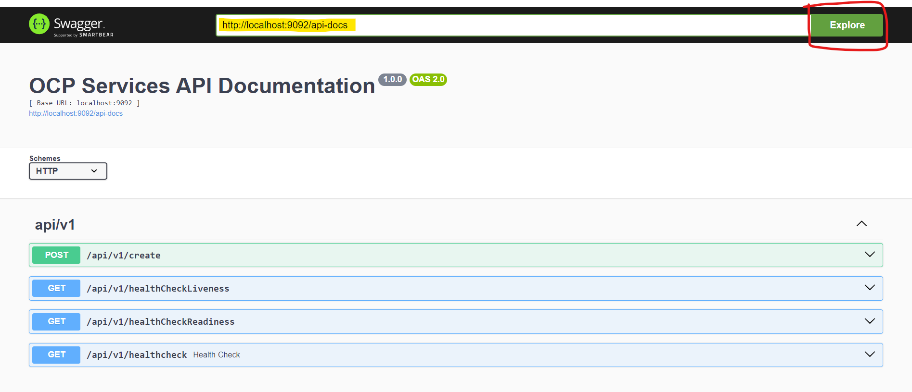

* Copy the API URL below, paste it into the <a href="https://petstore.swagger.io/" target="_blank">Swagger UI</a>, and click Explore.
**API URL:** http://localhost:9092/api-docs 

**EX.** 
<<<<<<< HEAD

=======

>>>>>>> 11847d721bbad65d841de7bcdab2bae64bf4fe0b
